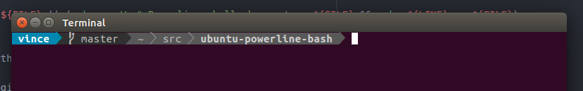

# ubuntu-powerline-bash

A script to quickly setup powerline **for bash** in **ubuntu**.

Powerline: https://github.com/powerline/powerline

## Use case

If you only want to quickly setup powerline for the bash prompt in ubuntu, this script saves you some manual steps.

## Run

    ./install.sh

Then logout and login again (if you open new terminals without logging-out first you will see some errors).

## Customization

Refer to https://powerline.readthedocs.org/en/latest/configuration.html#configuration-and-customization for how to customize the installation.

The configuration file will be in `./.local/lib/python3.6/site-packages/powerline/config_files/config.json`

*I am not responsible if this script damages your computer, use it at your own risk and understand what it does first!*
